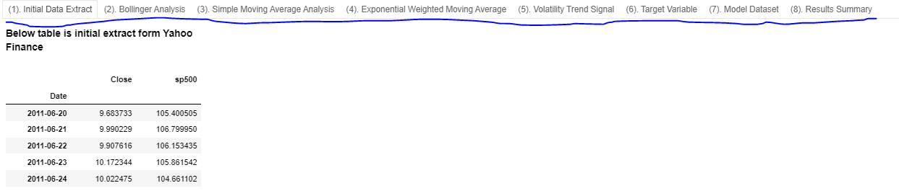
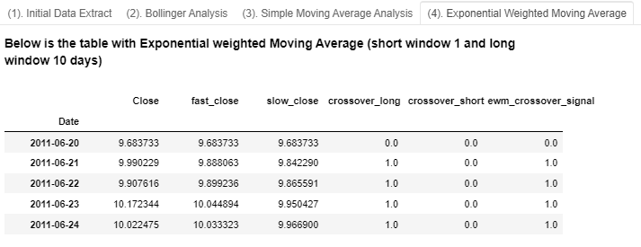

# **Project: Random Forest Prediction Model for user selected stock ticker - Next Trading day Prediction for Buy/Sell**

# **Project Team:**

Pranav Satheesan

Jude Yogarajah

Anthony Harrison

Mustafa Mufti

# **Project Overview:**

The project presents the below results:

-   assess the ten year historical daily returns for the user selected ticker.

-   build two random forest decision tree models for the ticker with depths three and four.

-   compare the RMSE and F1 Score for both models and provide Buy/Sell prediction for next day for model with either the lower RMSE score or higher F1 Score..

# **Prerequisites to Run Project Code:**

The project code comprises of:

-   The Jupyter Notebook file -- Project2.ipynb

-   Download the above file from GitHub

The below conditions should be met to seamlessly run the project code:

-   PyViz virtual environment should be installed.

-   yfinance should be installed within PyViz (pip install yfinance).

-   scikit-learn should be installed within PyViz (pip install scikit-learn).

# **The Final Product**

The project output is a dashboard with the following tabs as noted below:

The tabs in the dashboard include:

-   The sample of the initial data extract for the user selected ticker from Yahoo Finance

-   Bollinger analysis for the ticker with a 20 day rolling window standard deviation

-   Simple Moving Average analysis for the ticker for 50/100 days split

-   Exponential weighted Moving Average with short window 1 and long window 10 days

-   Volatility trend signal with short window 1 and long window 10 days

-   Conversion of daily returns to the target variable - to predict the next day retursn (BUY if next day returns are positive and SELL if next day returns are negative)

-   Model dataset with decision variable and features (Bollinger, Simple Moving Average, EWM and Volatility Trend)

-   Results Summary which shows the Root Mean Square and F1 Score assessment of two decision tree models - one with depth 3 and the other with depth 4. The prediction for the model woth lower RMSE score OR higher F1 Score is presented.

# **Project Limitations**

The below limitations are noted in the project and the associated final product:

-   The key data source used for assessment are daily closing prices for active tickers from Yahoo Finance and imported using yfinance library. Changes to the functioning of the yfinance library or any data share policies of Yahoo Finance will impact functioning of the code.

# **Project Results**

## Sample dashboard output for Apple Stock is presented below. Similar results can be obtained for any US ticker in Yahoo Finance with sufficient data history.

### The data history of the user selected ticker upto ten years is used for the model. The sample initial data extract is shown below:

### Post extraction of data, a bollinger analysis is conducted and the output is converted to a bollinger trading signal

### A simple moving average analysis is conducted and an associated trading signal is generated:

### An exponential weighted moving average analysis is conducted and an associated trading signal is generated:

### An volatility trend signal analysis is conducted and an associated trading signal is generated:

### The target variable is described as below using next day returns as the prediction:

### The model dataset is shown below with the decision variabole and features:

### The model result summary is presented below:

  
